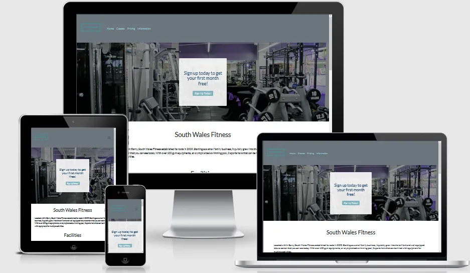

# **[South Wales Fitness](https://lewis-barton.github.io/south-wales-fitness/index.html)**

# **Project Description**

This project has been developed for my first Milestone project assignment following the Code Institute course I am currently completing. I have chosen the project idea from the list that was given of "Build a website for a gym"

I have decided to create a website for a fiction gym that is located in South Wales. After researching gyms that are located in my area I thought that I would take the information that I have found from these pre-existing companies and expand and adapt for the purposes of this project.

I have made some assumptions for this business for my User-Centric Front-End Development Milestone project. The gym has fixed schedules of the classes that occur, for which these schedule are the same each week and the same time, and they are included in the gym membership price.

From these assumptions and the information I have gathered I am using the 5 planes of UX methodology that has been explained within the course to; identify the user needs, the features are needed in the design, how the information is structured and logically grouped. These have then been used to produce a wireframe to show how this is implemented and a basis for what the project will look like on completion.

# **Index**

* [Project Description](#project-description)
* [UX](#ux)
  * [Project Goals](#project-goals)
  * [User Goals](#user-goals)
  * [Developer and Business Goals](#developer-and-business-goals)
  * [User Stories](#user-stories)
  * [Opportunities arising from User Stories](#opportunities-arising-from-user-stories)
  * [Design choices](#design-choices)
    * [Information Architecture](#information-architecture)
    * [UI Styling](#ui-styling)
  * [Wireframes](#wireframes)
* [Features](#features)
  * [Existing Features](#existing-features)
  * [Features left to Implement](#features-left-to-implement)
* [Technologies Used](#technologies-used)
* [Testing](#testing)
* [Deployment](#deployment)
  * [GitHub Pages](#github-pages)
  * [How to run this project locally](#how-to-run-this-project-locally)
* [Credits](#credits)
  * [Content](#content)
  * [Media](#media)
  * [Code](#code)
  * [Acknowledgements](#acknowledgements)

# **UX**

## Project Goals
---

The main objectives for this project is to create a website using HTML and CSS that is fully responsive to all screen sizes. It will also have a good UX Design following good colour theory, typography, and layout to make the interaction as enjoyable as possible for the user while meeting the business goals outlined below.

[Back to Index](#index)
## User Goals
---

The main audience for this website will be customers that are either existing members of the gym or potential members, who want to know more about the gym, its facilities and its procedures.

[Back to Index](#index)
## Developer and Business Goals
---

The website must be fully responsive for all platforms adjusting the design when needed to improve the User Experience. To meet the business needs for the website it must interest and attract new customers and retain existing members.

[Back to Index](#index)
## User Stories
---

The intended audience of this website are users of any age who are looking for a gym to join, or existing members who are looking to find what classes are available and on what days.

Keeping this target audience in mind I have identified the below user stories:

1. As a user, it is easy to see the classes available and their schedule.

1. As a user, the site will be easy to navigate with minimal clicks to get to the correct information.

1. As a user, I will be able to see customer feedback from current or previous members.

1. As a user, it will be clear the pricing for a session and what is included in each session.

1. As a user, it will be easy to find information on the gym and the facilities available.

1. As a user, it will be easy to find contact information for the gym.

1. As a user, it will be easy to find external links for more frequent updates (social links, etc.)

From this I have also identified the following stories from an owner's perspective.

1. As the owner, it will be easy to display current offer's available within the gym.

1. As the owner, I will be able to fully showcase the facilities available.

1. As the owner, I will be able to showcase customer reviews to encourage new members.

[Back to Index](#index)
## Opportunities arising from User Stories
---

Opportunities | Importance | Feasibility/Viability
:---: | :---: | :---: |
**Appealing, simple interface** | 5 | 5
**Website meets needs of the user and owner** | 5 | 5
**Customer testimonials** | 5 | 5
**Session pricing and contents** | 5 | 5
**Monthly costs and current deals** | 5 | 5
**Contact information** | 5 | 5
**Social Links** | 4 | 5
**Showcase facilities** | 3 | 5
**~~Online booking system~~** | 2 | 1
**~~Gym history/about the owner~~** | 1 | 5

[Back to Index](#index)
## **Design Choices**
---

### **Information Architecture**

Considering the information that has been outline in the previous two sections I have decided to opt for the standard tree structure to spread across three pages in total.

The aspects that will be **shared** across all three of the pages are as follows:

* The navigation panel will be located at the top of the page which will include the company logo and links to the other pages.
* The footer will consist of the copyright information as well as social links

The **Home Page** will hold the following information:

* Hero image with CTA for current offer - links to pricing page.
* Below will be the available facilities.
* Customer testimonials at the bottom of the page.

The **Classes Page** will hold the following information:

* Weekly timetable of the classes that are available with days, times & class durations.
* Description of what is included in each class

The **Pricing Page** will hold the following information:

* Current offer available will be located at the top of the page with CTA.
* What is available in each pricing structure.
* Pricing structure located at the bottom.

The **Information Page** will hold the following information:

* Contact information.
* How to join.
* FAQs.
* Disclaimer.

[Back to Index](#index)
### **UI Styling**

Given the intentions and purpose of the website I decided on the following style choices to supplement the content and provide a good UX.

#### **Colours**

After doing some initial research and coming across the article written by MyPTWebsite (links to full article and accreditation in the credits section at the bottom). I have decided to go with blue for the sections of colour, this is because research has show that this will increase focus and concentration which is what the gym is trying to reflect, it also gives the users a sense of trustworthiness for the website and brand. Alongside these colours I will be using a subtle black and white theme with good whitespace to minimize colour clashing when possible.

#### **Styling**

When considering the important aspects of the styling of the website I had to think about what the average user would be viewing it on and the situations that the site might be used. This lead me to decide I will be using the **mobile first** philosophy as I believe most users will be on this sort of device.

I will ensure that the design is as clean and simple as possible with very clear and intuitive navigation (typical hamburger layout on mobile devices). All pages will be fully responsive and adapt to each breakpoint appropriately adding more functionality on the larger screens.

[Back to Index](#index)
## Wireframes
---

All wireframes were completed in Balsamiq before any programming had started. I have used these to base the design and development of the website, however these can potentially change from the later designs.

* [Home Page](wireframes/south-wales-fitness-home-page.pdf)
* [Classes Page](wireframes/south-wales-fitness-classes-page.pdf)
* [Pricing Page](wireframes/south-wales-fitness-pricing-page.pdf)
* [Information Page](wireframes/south-wales-fitness-information-page.pdf)

[Back to Index](#index)
# **Features**

## Existing Features
---

From what was identified in the UX process of features I have completed the following.

* Appealing, simple interface - The interface that I have designed is used mainly using bootstrap classes with some additional styling, this makes a clean looking interface that is also familiar to the user as it will be similar to a large number of other sites.
* Website meets needs of the user and owner - The website is clear from the first page what it is about, and it is intuitive in it's navigation that it is easy to direct the use to the information that they are after. This both meets the needs of the user (trying to find information on the gym etc.) and the owner (promoting their business to retain current members and attract new members).
* Customer Testimonials - I have added 2 customer testimonials to the front page of the site to show appeal to potential customers that are visiting.
* Session pricing and contents, monthly costs and current deals - All of the relevant pricing information, and current deals are clearly shown on pricing.html and the session timetable and contents can all be clearly seen on classes.html
* Contact information - the contact information is clearly visible and the first item that is seen on the information tab, making it easy for the users to know how to find/contact the business.
* Social links - The social links are clearly shown with the icon links in the footer of each page, their styling remains consistent and the placement remains the same site wide so they are easy to locate.
* Showcase facilities - The home page clearly shows all of the facilities that the gym has to offer. This means the user will be able to see everything that the gym has to offer when making a decision about the gym, and the owner has clearly shown the gym's facilities straight away.

[Back to Index](#index)
## Features left to Implement
---

Below are the list of features that I would have like to implement to further improve upon the site but I was unable to do so at the time.

* Online booking system for classes. - Due to my lack of back-end knowledge at the time of completing this I am unable to add this feature.
* Separate personal trainer tab with trainer information and booking portal. - Due to the time restraints that I had with this project I was unable to implement a further page to dedicate to personal trainers and as above due to knowledge limitations I am unable to produce a booking system with my current skill set.
* Further customer testimonials - I would like to have added more customer testimonials, that can be dynamically changed without having to hard code the images and responses into the website - I do not have experience in using a CMS so I am unable to use this to import information into a section on the site.
* Gym history/about the owner - This section while it may not have been of high importance was one that I would have liked to of added if I had the time to do so. Unfortunately due to the time restraints that were imposed with this project I was unable to get this implemented in a way that I would of been happy with but is something that I would like to get added if I was to continue with the development for this.

[Back to Index](#index)
# **Technologies Used**

* [Balsamiq](https://balsamiq.com/) was used to produce all of the wireframes for the project.
* [VS Code](https://code.visualstudio.com/) was used to develop this website.
* [GitBash](https://git-scm.com/downloads) was used for Git version Control and pushing to GitHub.
* [Bootstrap](https://getbootstrap.com/) was used for styling and utility classes.
* [Font Awesome](https://fontawesome.com/) was used for the icons on the site.
* [Lazysizes](https://github.com/aFarkas/lazysizes?utm_source=cdnjs&utm_medium=cdnjs_link&utm_campaign=cdnjs_library) was used to optimise loading of images.
* **HTML and CSS** are the two languages that are used during this project.
* [Google Fonts](https://fonts.google.com/) was used for the fonts for the website.
* [typosaurus](https://typosaur.us/) was used for spell-checking deployed web pages.
* [Google Maps URLs](https://developers.google.com/maps) was used for address link to open directions.
* [Code Spell Checker](https://marketplace.visualstudio.com/items?itemName=streetsidesoftware.code-spell-checker) was used for spell checking all documents.

[Back to Index](#index)
# **Testing**

For full documentation on how all of the tests on each document were carried out please see my [testing write up here](testing.md) where I go through
the process for each page, what was checked, how it was checked and if any errors arose from these test, how they were fixed.

[Back to Index](#index)
# **Deployment**

## GitHub Pages
---

This project was developed using [VS Code text editor](https://code.visualstudio.com/) along side the [Live server by ritwick dey](https://ritwickdey.github.io/vscode-live-server/) extension, committed to git and pushed to GitHub using the [GitBash](https://git-scm.com/downloads) terminal.

To deploy this page to GitHub Pages from its [GitHub repository](https://github.com/Lewis-Barton/south-wales-fitness), the following steps were taken:

1. Log into GitHub
1. From the list of repositories on the screen, select **Lewis-Barton/south-wales-fitness**
1. Select **Settings**, from the menu items near the top of the page.
1. Select **Pages**, from the tab on the left hand side of the screen.
1. Under the **Source** section, click the drop-down menu labelled **none** and select **Main**.
1. On selecting Main Branch the page is automatically refreshed, and the website is now deployed.
1. Go back to the **Pages** section to retrieve the link to the deployed website.

[Back to Index](#index)
## How to run this project locally
---

It is also possible to run this project on a local machine, in order to do this you would have to clone this project from GitHub. There are multiple ways in which this can be completed, these have been outlined below.

**Cloning with Git Bash**

1. Follow this link to the [GitHub repository](https://github.com/Lewis-Barton/south-wales-fitness)
1. Near the top of the page on the right hand side there will be a button labelled 'Code' click on this.
1. In the HTTPS section click the clip board on the right hand side to copy the URL.
1. Open [Git Bash]() on your machine.
1. Change the working directory to the location where you want the repository to be cloned to.
1. Type `git clone` then paste the URL copied from section 3
`git clone https://github.com/Lewis-Barton/south-wales-fitness.git`

1. Press Enter and you local clone will begin downloading and be created onto your machine.

**GitHub Desktop**
1. Follow this link to the [GitHub repository](https://github.com/Lewis-Barton/south-wales-fitness)
1. Near the top of the page on the right hand side there will be a button labelled 'Code' click on this.
1. Below the HTTPS section there is an option labelled "Open with GitHub Desktop"
1. If you have this installed it will open up the programme on your machine, if you follow the steps shown on the screen you will then have a copy of the repository on your machine. If you do not have the programme installed on your machine then clicking on this option will take you to the download section for GitHub Desktop, once this has been downloaded and installed it will continue setting up the repository to be copied to your machine locally.

**Download and extract the zip directly from GitHub**
1. Follow this link to the [GitHub repository](https://github.com/Lewis-Barton/south-wales-fitness)
1. Near the top of the page on the right hand side there will be a button labelled 'Code' click on this.
1. At the bottom of this pop-out there is an option labelled "Download ZIP" press this button to download the full directory to your machine.
1. Once the ZIP has been downloaded open it with your extractor of choice (7zip, WinRAR, etc.)
1. If you drag and drop the folder inside of this it will have all of the files from the repository to be viewed/edited on your local machine.

[Back to Index](#index)
# **Credits**

## Content
---

* [tfliving](https://tfliving.com/2020/03/13/10-popular-group-fitness-classes-and-what-to-expect-if-you-go-to-one/) - Article of sample classes offered in a gym that the classes for the website were chosen from. This was also used as inspiration for class descriptions.
* [Fit & Me](https://www.fitandme.com/guide-gym-equipment-names-how-to-use/) - Article with list of gym equipment that was used for the facilities section.
* [Eat, Sleep, Wander.](https://eatsleepwander.com/gym-review-example/) - Testimonial inspiration taken from this article.

[Back to Index](#index)
## Media
---

* [MyPTWebsite](https://www.mypersonaltrainerwebsite.com/blog/how-to-use-color-psychology-to-create-the-perfect-fitness-website) - Article on the psychology of colours in fitness to decide basis for colour palette.
* [Hatchful](https://hatchful.shopify.com/) - Generated the logo for the business through their creation tool.
* [Color Hunt](https://colorhunt.co/palette/257808) - Used to find colour palette to use
* [Unsplash](https://unsplash.com/) - Images on the website are taken from unsplash individually commented with links.
* [Am I Responsive](http://ami.responsivedesign.is/) - Used to produce responsive image mock-ups to illustrate for the testing section.

[Back to Index](#index)
## Code
---

* [Google WebP Docs](https://developers.google.com/speed/webp/docs/using) - Learning resource.
* [MDN](https://developer.mozilla.org/en-US/) - Learning resource.
* [Bootstrap Docs](https://getbootstrap.com/docs/4.6/getting-started/introduction/) - Learning resource.
* [BootstrapCreative](https://bootstrapcreative.com/bootstrap-push-pull-column-ordering-tutorial/) - Tutorial for bootstrap order class
* [Google Maps Platform](https://developers.google.com/maps/documentation/urls/get-started#map-examples_1) - Learning resource
* [Markdown Cheatsheet by Adam P](https://github.com/adam-p/markdown-here/wiki/Markdown-Cheatsheet) - Learning resource

[Back to Index](#index)
## Acknowledgements
---

At this stage I would like to thank my friends and family for the feedback that has been provided on the site as I continued to develop it, as well as my mentor Gurjot for his feedback and insights at this stage also.

[Back to Index](#index)